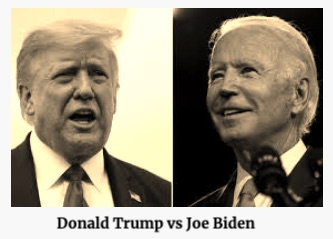

>Dù có đồng tình với chính sách của tổng thống Mỹ, Donald Trump, hay không, mọi người phải công nhận rằng sau 4 năm tại chức, ông đã thay đổi cục diện thế giới một cách sâu sắc. Tiếp tục chính sách hiện tại hay nên thay đổi, cuộc bầu cử Mỹ 2020 sẽ ảnh hưởng quan trọng đến hướng đi Thế giới trong thế kỷ 21 trong đó có những vấn đề sinh tử đối với Việt Nam. Tối ngày 29 tháng 9 năm 2020, lúc 9 PM giờ California, cuộc tranh luận hiệp một giữa 2 ứng cử viên tổng thống Mỹ, Donald Trump và Joe Biden, sẽ diễn ra ở thành phố Cleveland, bang Ohio.

Nhắc lại chuyện cũ, năm 1975 khi cuộc chiến Nam-Bắc Việt Nam đang diễn ra khốc liệt, miền Nam Việt Nam (tức Việt Nam Cộng Hoà) hết đạn dược, tổng thống Mỹ, Gerald Ford thuộc đảng Cộng Hoà, yêu cầu Quốc Hội phê chuẩn một gói ngân sách tiếp viện khẩn cấp $300 triệu Mỹ kim, cho Việt Nam Cộng Hoà. Nhưng quốc hội Mỹ lúc đó, dưới sự kiểm soát của đa số nghị sĩ Dân Chủ đã bỏ phiếu bác yêu cầu này, một cách gián tiếp bỏ rơi và thường bị người miền Nam kết tội "bức tử" Việt Nam Cộng Hoà. Mối hận này dù theo năm tháng vẫn chưa phai, cho nên cộng đồng người Việt tỵ nạn từ khi hình thành tại Mỹ, về mặt chính trị, đã trung thành ủng hộ đảng Cộng Hoà một cách mạnh mẽ, khác với đa số những cộng đồng sắc dân Á Châu khác thiên về khuynh hướng thân đảng Dân Chủ. 

Đó là chuyện của nửa thế kỷ trước, gần đây hơn, khi Trung Quốc đang lấn chiếm Biển Đông và uy hiếp Việt Nam, chính sách chống Trung Quốc kịch liệt của tổng thổng Mỹ thuộc đảng Cộng Hoà, Donald Trump, thu phục được sự ủng hộ nhiệt tình mạnh mẽ và rõ rệt của người Mỹ gốc Việt. Đến nỗi, ai có những phát biểu nào mang tính phê phán tổng thống Trump sẽ bị đám đông ném đá một cách không thương tiếc. Điển hình sự cố "tai nạn nghề nghiệp" liên quan đến phát biểu chế diễu tổng thống Trump của MC Nguyễn Ngọc Ngạn, một người được đa số quần chúng Việt trên thế giới yêu thích qua cách dẫn chuyện uyên bác và duyên dáng của những chương trình văn nghệ Thuý Nga Paris.

[Nguyen Ngoc Ngan chính thức lên tiếng về phát biểu liên quan đến TT Trump] (https://www.youtube.com/watch?v=taEZ0WlBXXU)

Trên thực tế, sự ủng hộ của cử tri Việt tại những tiểu bang có đông đảo người Việt định cư gần như không có chút ảnh hưởng nào đến kết quả bầu cử tổng thống, khi số phận của những tiểu bang này gần như đã được định trước do sự hình thành chính trị xã hội ổn định từ nhiều năm, ví dụ như California gần như chắc chắn sẽ bỏ phiếu cho Dân Chủ Biden, trong khi Texas cho Cộng Hoà Trump. Nhưng ngược lại cử tri Việt ở những nơi xa xôi hẻo lánh của nước Mỹ lại có tiềm năng ảnh hưởng lớn lao đến của tranh cử tổng thống năm nay. 

Tác động "làm lệch cán cân" của cử tri ở những nơi được giới báo chí Mỹ gọi là "tiểu bang chiến trường (battleground states)" như Ohio, Florida, Arizona, Georgia, hay North Carolina, cực kỳ quan trọng. Tỷ số thắng thua đôi khi chỉ khác nhau chừng vài chục hay vài trăm lá phiếu. Mặc dầu ít ỏi, nhưng vì sự suýt soát của cuộc chạy đua, một nổ lực tích cực xuống đường bỏ phiếu của người Việt ở những nơi này cũng có thể đảo lộn kết quả ai làm tổng thống của nước Mỹ. Đây là một bài học còn nóng hổi chưa quên khi vào năm 2016, bà Hilary Clinton mặt dầu thắng về tổng số phiếu hơn đối thủ Donald Trump gần 3 triệu, mà vẫn thua phiếu cử tri đoàn vì tác động "làm lệch cán cân" của những tiểu bang chiến trường.

[Bản đồ cử tri đoàn bầu cử tổng thống 2020] (https://www.270towin.com/maps/consensus-2020-electoral-map-forecast)

Cũng không thể không nhắc tới một thành phần người Mỹ gốc Việt, sau nhiều năm sống trên nước Mỹ, đã bắt đầu đặt nặng quan tâm về những vấn đề mang tính đời sống như an sinh, công bằng xã hội, chính sách di dân, y tế hoặc giáo dục. Và họ có khuynh hướng ngã về phía đảng Dân Chủ khi đảng này để tâm tới các vấn đề đối nội nhiều hơn so với đảng Cộng Hoà. Sự thầm lặng của họ vì tập quán an thân tránh tranh cãi đối chất ồn ào công khai không có nghĩa là họ không có mặt. Nhưng, thường thì phải đợi đến kết quả sau bầu cử, nhất là những chức vụ địa phương như thị trưởng, nghị viên thành phố, giám sát viên quận, uỷ viên giáo dục, hạ nghị sĩ hay thượng nghị sĩ tiểu bang, người ta mới thấy được sự hiện diện này.

Vào lúc 9 giờ tối giờ California, cuộc tranh luận tổng thống cho nhiệm kỳ 2020, hiệp một, sẽ xảy ra tại thành phố Cleveland, của tiểu bang chiến trường Ohio, phát súng đầu tiên chính thức báo hiệu cuộc chay đua nước rút giai đoạn cuối vào Toà Bạch Ốc. Ai thắng chức vị tổng thống nước Mỹ vào năm 2020 không những sẽ có ảnh hưởng lớn lao đến hướng đi của thế giới trong thế kỷ 21, mà còn quyết định đến những vấn đề sinh tử liên quan đến Việt Nam.

<iframe width="420" height="315" src="https://www.youtube.com/embed/d3C6x7VNKeo"></iframe>
 

